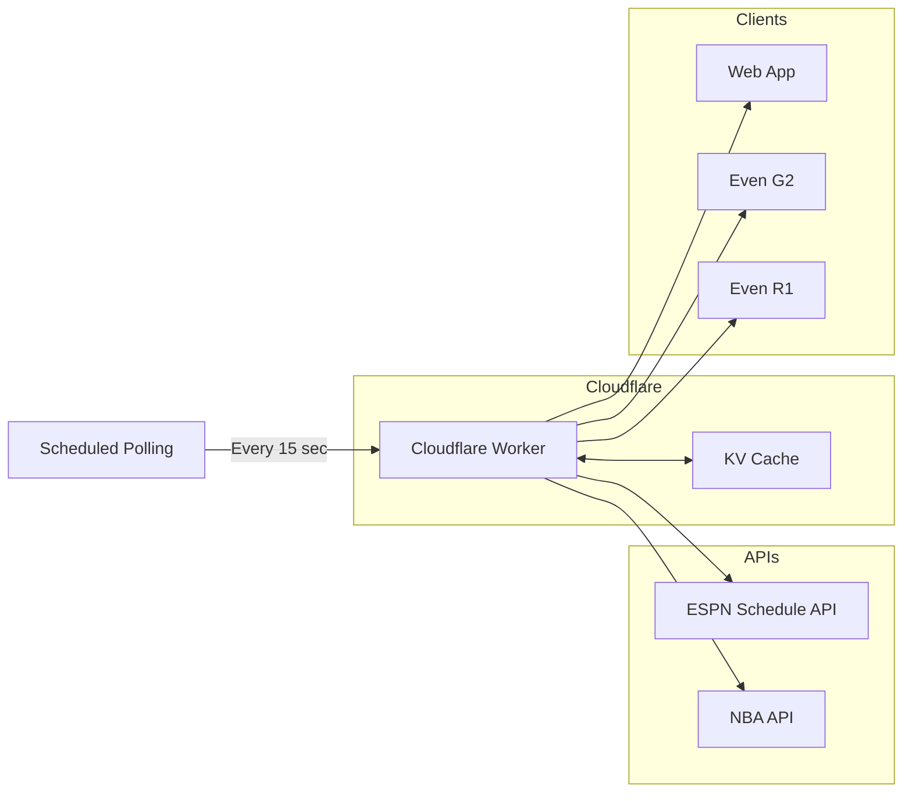
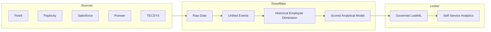
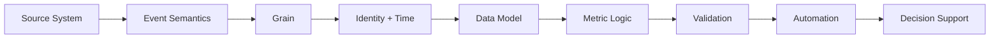

# Minna Cross

## Analytics Engineer · Data Systems · Agentic Systems

💻 [LinkedIn](https://www.linkedin.com/in/minna-cross/) · 📍 Ohio / Remote

---

*I uncover the questions no one thought to ask and build the systems to answer them.*

I build data and automation systems for messy operational problems — especially where the difficult part is figuring out what the data actually represents before deciding how to model, measure, or automate it.

My work spans source-system investigation, analytics engineering, dimensional and semantic modeling, analytical automation, and independent agentic-systems R&D.

---

## 🔧 Core Stack

| Area                         | Technologies & Methods                                                                                                                                               |
| ---------------------------- | -------------------------------------------------------------------------------------------------------------------------------------------------------------------- |
| **Data Engineering**         | SQL, Python, Snowflake, Redshift, PostgreSQL, MySQL, ETL/ELT, APIs, JSON                                                                                             |
| **Modeling**                 | Dimensional modeling, Type 2 SCDs, temporal joins, hierarchical data, metric design                                                                                  |
| **Analytics**                | Looker / LookML, Power BI / DAX, Tableau, MicroStrategy, Alteryx                                                                                                     |
| **Data Investigation**       | Grain analysis, reconciliation, source validation, anomaly investigation, temporal logic                                                                             |
| **Agentic Systems**          | LLM orchestration, reusable agent skills, multi-agent coordination, human-in-the-loop controls, bounded autonomy, retrieval grounding, provenance and drift auditing |
| **Engineering & Governance** | GitHub, CircleCI, CI/CD, Terraform, lineage, documentation, data quality, sensitive-data controls                                                                    |

---

# Selected Systems

## 🤖 Agentic Systems Architecture

### Independent R&D · OpenClaw

I use agentic systems as a systems-engineering problem rather than treating model capability as sufficient evidence that an agent should be allowed to act.

My current OpenClaw environment operates as an orchestrated multi-actor runtime built around **12 reusable agent skills**. Skills encode reusable decision logic alongside failure modes and explicit boundaries for when they should not be used.

I also designed an **L0–L5 authority model** that separates what an agent *can* do from what it is *authorized* to do. Consequential actions are governed through escalation paths and human-override controls rather than relying solely on runtime model judgment.

A provenance and capability audit evaluates state across memory, knowledge, skills, ownership, dependencies, access boundaries, stale references, and configuration drift. Its first full run identified **19 broken cross-references and one missing-ownership regression**, which were then converted into additional system-level controls.

The retrieval layer tracks source identity, evidence weighting, confidence, contradictions, and unresolved questions so retrieved information can be evaluated for more than semantic relevance alone.

---

## 🏀 Even NBA

Real-time NBA data application designed for **Even Realities G2 glasses and R1 ring** interactions.

The application automatically selects active games, falls back to upcoming schedule data when no game is live, caches responses through Cloudflare KV, and exposes live status and play-by-play data across the web interface and device interactions.

---

## 🏗️ Cross-Functional Workforce Analytics

### Truepill

Built a workforce analytics system that unified operational and employee-performance data across **Five9, Paylocity, Salesforce, Pioneer, TECSYS, and Snowflake**.

A major challenge was **historical attribution**.

Employees changed managers, teams, and cost centers over time, which meant joining historical activity to current employee state produced incorrect reporting.

I built a **Type 2 Slowly Changing Dimension** with effective-date ranges so work could be attributed according to the employee's organizational state when the work occurred.

I also built event-level attribution logic using SQL window functions to determine which employee actually performed specific fulfillment tasks instead of relying on current or order-level assignment.

The resulting analytics system supported more than **200 employees**, eliminated approximately **15 hours per week of manual Excel reporting**, and became a common analytical source for workforce-performance reporting.

---

# Current Professional Work

## Hilton · 2025–Present

My current work focuses on analytics and optimization for contact-center operations.

I build reusable analytical frameworks that combine operational, CRM, telephony, contact, booking, and workforce data; investigate source behavior and data-quality issues; develop SQL, Python, and Alteryx workflows; and build Power BI semantic models for operational and financial analysis.

A growing portion of the work is focused on **analytical automation**: converting recurring investigation and business-review processes into reproducible Python-based systems that identify meaningful movements, validate metrics, and generate structured reporting outputs.

I also support metric standardization, documentation, reproducible query logic, and data-governance practices across analytical work.

---

## Truepill · 2022–2025

Worked across the full analytics stack from source-system discovery through Snowflake modeling, governed LookML, operational analytics, and reporting.

Additional systems included a self-maintaining Snowflake business calendar, real-time SLA monitoring designed to surface revenue at risk before failures compounded, CI/CD workflows through GitHub and CircleCI, and analytics involving HIPAA-regulated PHI and sensitive PII.

---

## Earlier Systems Work · 2014–2022

Before moving fully into data analytics, I worked extensively with workforce-management and operational systems across forecasting, capacity planning, system configuration, automation, troubleshooting, documentation, and long-term system maintenance.

That background is a major reason I tend to treat data problems as **systems problems first**.

---

# How I Approach Data Problems

When a number is wrong, the problem is often not the calculation.

I tend to work backward through the system:

The questions I care about are things like:

* What business event does this record actually represent?
* What is the true grain?
* Which timestamp corresponds to the event being measured?
* Is this current state or historical state?
* Which source is authoritative?
* What did a join add, remove, or duplicate?
* Does the metric remain valid under different filter contexts?
* Is the discrepancy in the calculation, transformation, source data, or underlying operational process?

The goal is not simply to produce a result.

It is to understand the mechanism well enough that the result can be trusted and the solution can be reused.

---

# 🎓 Education

**B.S. Data Science — University of Maryland Global Campus**
*In Progress · Expected 2028*

**GPA:** 4.0

**Academic focus:** Algorithmic bias, Responsible AI, data governance, and human-centered evaluation of automated systems

**Honors:** Dean's List · Alpha Sigma Lambda, Tau Chapter — Fall 2026 Inductee
