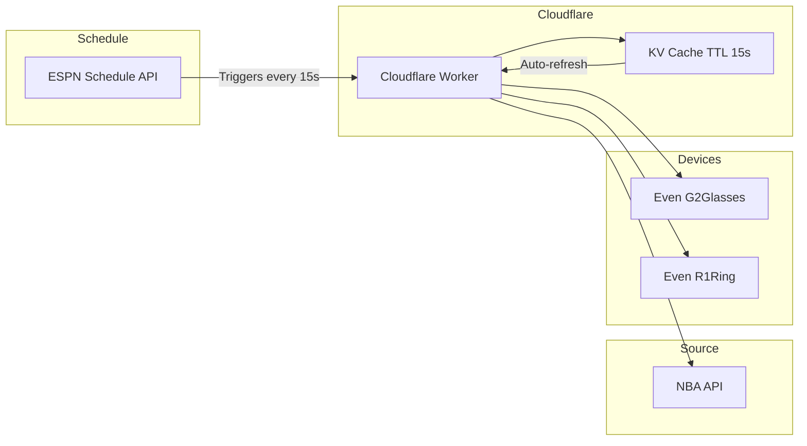
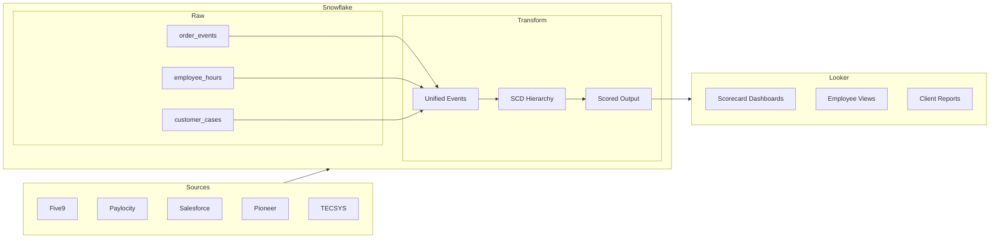
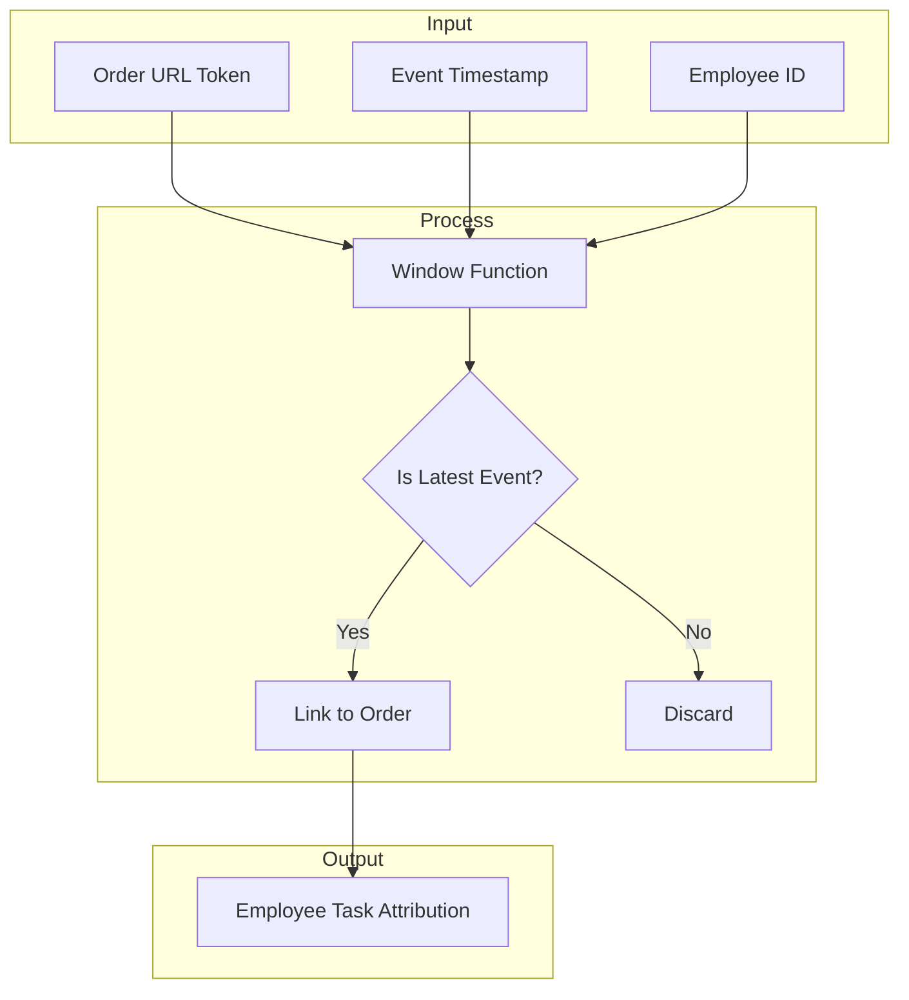
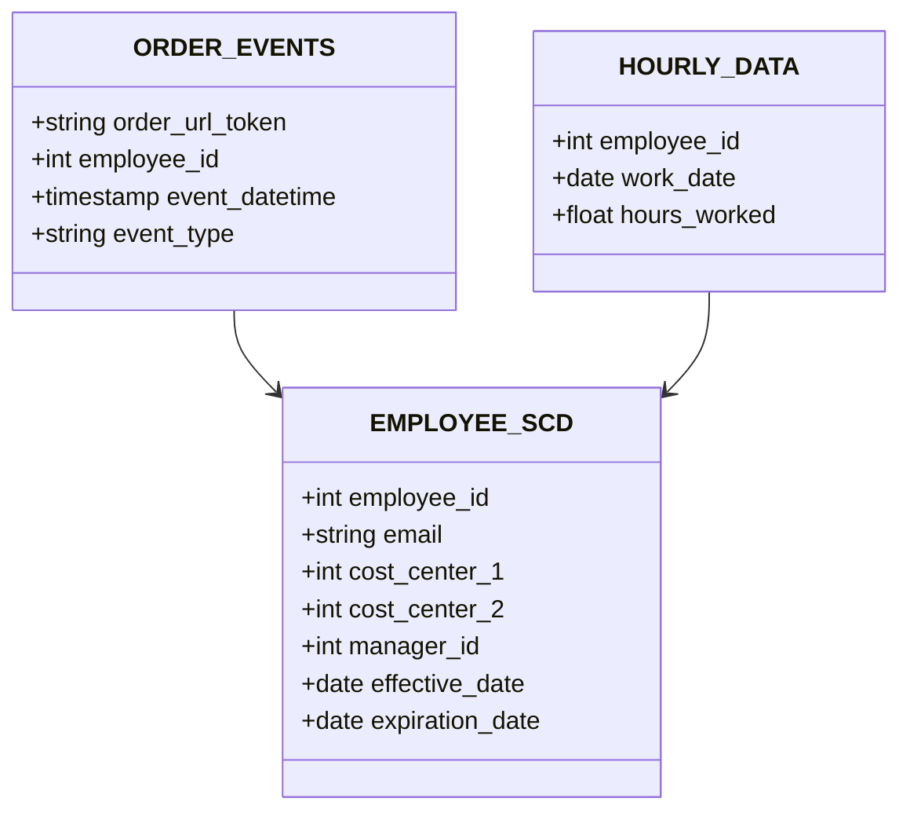
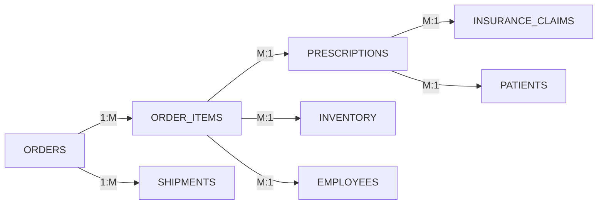

# Minna Cross

## Analytics Engineer

💻 [LinkedIn](https://www.linkedin.com/in/minna-cross/) | 📍 Remote Worker

* * *

*I don't build dashboards. I build data systems — from finding where data lives in multiple source systems to turning it into something useful.*

* * *

## 🔧 Technical Stack

| Category | Skills |
| --- | --- |
| **Languages** | SQL (Advanced), Python |
| **Warehouse** | Snowflake, Redshift |
| **Databases** | MySQL, PostgreSQL |
| **BI & Viz** | Looker (LookML), Tableau, PowerBI (DAX), MSTR, Alteryx Designer |
| **ETL/ELT** | Custom SQL pipelines, PDTs, change data capture |
| **Data Discovery** | LATERAL FLATTEN, nested JSON, source system exploration |
| **Data Governance** | Data dictionaries (internal & external), documentation, lineage tracking |
| **Infrastructure** | Terraform |
| **CI/CD** | CircleCI |
| **CRM & Operations** | Salesforce, Twilio |
| **Workforce Systems** | Five9 (WFO), Paylocity (HRIS), Kronos, UKG, IEX, Verint |
| **Industry Systems** | Pioneer (Pharmacy), TECSYS (WMS), EMR |
| **Version Control** | GitHub |
| **Methodologies** | Dimensional modeling, SCD Type 2, HIPAA/PHI/PII handling |
| **Project Management** | Jira, Confluence |
| **Agile** | Scrum, sprint planning, backlog refinement |

* * *

## 💻 Personal Projects

### Even NBA (for Even Reality)
Real-time NBA scores app for Even Reality G2 (glasses) & R1 (ring) smart devices:

**Features:**

* Triggers Cloudflare Worker every 15 seconds
* Auto-selects active (live) NBA games, falls back to schedule for upcoming from ESPN
* Green glowing "Live Feed" badge when game in progress on webapp
* Play-by-play timeline with monospace alignment
* Tap to cycle through games
* Supports both G2 glasses and R1 ring functionality

* * *

## 🏢 Work Experience

### Senior Business Intelligence Analyst — Hilton

*May 2025 – Present* | Remote

Analytics resource for HRCC (Hilton Reservations & Customer Care) operations, focusing on data efficiency and guest service outcomes.

**What I'm working on:**

* Building ETL pipelines that combine Salesforce, telephony, and case data to model how contacts get routed and where service breaks down
* Creating Alteryx workflows + Python scripts for anomaly detection — catching unusual patterns in IVR (interactive voice response) behavior before they become problems
* Developing behavioral clustering models to segment caller types and optimize routing logic
* Mentoring other analysts on writing reproducible, testable SQL

* * *

### Data Analyst — Truepill

*Mar 2022 – May 2025* | Remote

This was a **full-stack analytics role** — I didn't just build reports, I built the entire data infrastructure from discovery to dashboard.

**The Cross-Functional Scorecard (CFSC)**

Built from scratch to unify workforce performance data across 5+ disconnected systems:

**Impact:**

* Served 200+ employees with self-service analytics
* Eliminated ~15 hours/week of manual Excel reporting
* Single source of truth for workforce performance

* * *

## 🏗️ Architecture Deep Dive

### Problem 1: Employee Attribution

**The challenge:** When an order moves through the system, multiple employees touch it (PV1 verification, PV2 verification, fill, pack). Traditional reporting couldn't tell you *which employee* completed *which task*.

**My solution:**

Used `ROW_NUMBER()` to identify the last event per task type, then joined back to the order. This let us attribute work to the exact employee who did it — not just whoever was assigned to the order.

**Dynamic weighting:** Different tasks have different complexity. I built percentile-based scoring (1-5 scale) that normalizes across task types so a fast packer gets compared fairly to a fast verifier.

* * *

### Problem 2: Historical Reporting

**The challenge:** Employees moved between cost centers and supervisors. Traditional joins gave you whoever was currently assigned — not who was responsible on the date the work happened.

**My solution:**

Built a **Type 2 Slowly Changing Dimension (SCD)** that tracks every change to cost center and manager assignment with effective dates. Now you can ask "who was this person's supervisor on March 14, 2023?" and get the right answer.

This was a problem no one else at Truepill could solve. It became the foundation for all workforce reporting.

* * *

### Problem 3: Complex Joins

**The challenge:** Pharmacy fulfillment involves orders → items → prescriptions → claims → inventory → patients → employees. Traditional reports showed one table at a time.

**My solution:**

Built a 20+ join Looker Explore that allowed C-Suite see the full journey of a prescription from order to patient delivery with drill downs.

* * *

### Problem 4: Nested JSON in Source Systems

**The challenge:** Pharmacy system stored user data in nested JSON arrays — doctors had both `EMR_CONFIGURATION` and `PROGRAMS` as arrays, each containing multiple values.

**My solution:** Used Snowflake's `LATERAL FLATTEN` to explode these arrays into rows:

    SELECT 
        D._ID AS USER_ID,
        EMRCONFIGURATION.VALUE:"_id"::STRING AS EMR_PROGRAM_ID
    FROM STITCH.SOURCE.DOCTORS D,
    LATERAL FLATTEN(INPUT => D.EMRCONFIGURATION:"programs") EMRCONFIGURATION

This let us finally do analytics on which programs each doctor was certified for.

* * *

## 🎓 Education

**Bachelor's degree, Data Science** — University of Maryland Global Campus  
*Jul 2025 — Expected 2028*  
**GPA:** 4.0
**Honors:** Dean's List (Fall 2025)

* * *

### 📜 Certifications

**LinkedIn Learning:**

* SQL for Data Analysis (2026)
* Analyzing and Visualizing Data in Looker (2025)
* Prepare Data for Looker Dashboards and Reports (2025)
* Developing Data Models with LookML (2025)
* Alteryx for Healthcare (2026)
* Alteryx Analytics Tips and Tricks (2026)
* Introduction to Alteryx (2026)
* Data-Driven DEI Decision-Making (2026)
* The Data Analytics of Diversity, Inclusion, and Well-being (2026)
* Auditing Design Systems for Accessibility (2026)

**Notion:**

* Notion Advanced Badge (2026)
* Notion Workflows Badge (2026)
* Notion Essentials Badge (2026)

**Microsoft (GitHub):**

* Introduction to Git (2025)
* Introduction to GitHub (2025)
* Introduction to GitHub Actions (2025)
* Manage and configure repositories (2025)

**Coursera:**

* What is Data Science? — IBM (2023)
